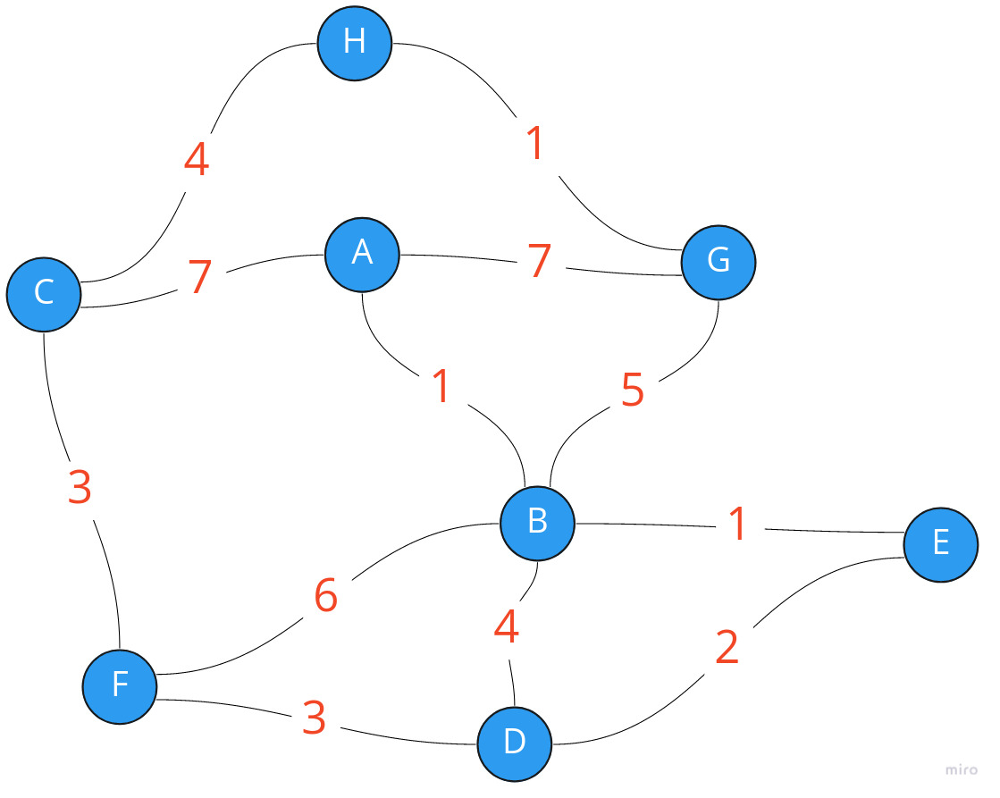
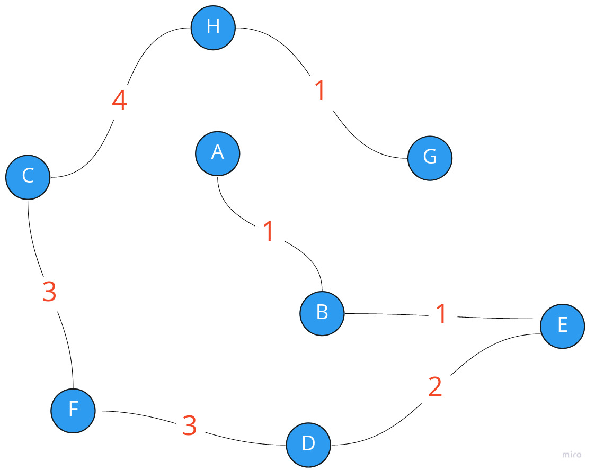

# Kruscal algorithm

## Description
This program is a final task for algorithms and data structures course. <br />
Thats why all structures that are used in Kruscal's algorithm were implemented by hands. <br />

File `structures.h` contains implementation of dynamic array(vector), red-black tree and disjoint set(for algorithm's efficiency).

## Usage

Program input is set of triplets, where first two letters represent edge between verticies and third number is edge's weight. <br />
Such input as:<br />
```A B 1 
A C 7
A G 7
G H 1
H C 4
F C 3
D F 3
E D 2
E B 1
B F 6
B D 4
B G 5
```
is a representation of a graph:


And output of a program for this situation is:<br />
```
A B
G H
E B
E D
D F
F C
H C
15
```
, where pairs of letters are edges in minimum spannig tree and number is a sum of edge's weights.<br />
For particular exaple:

