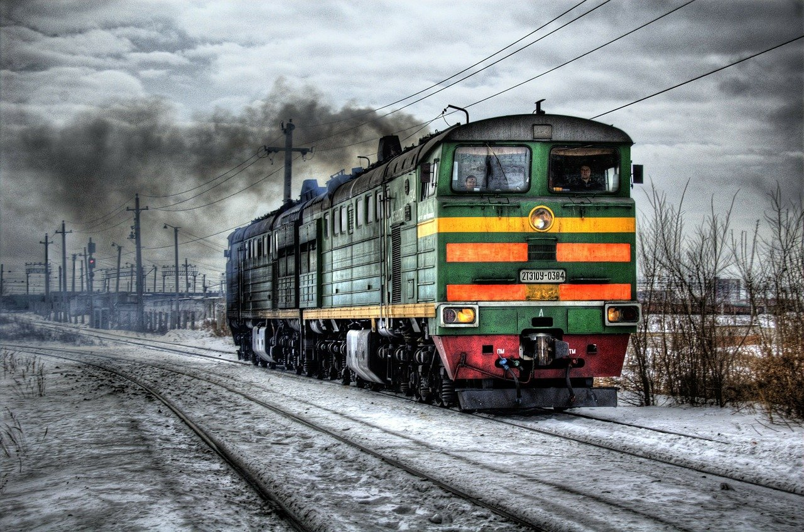
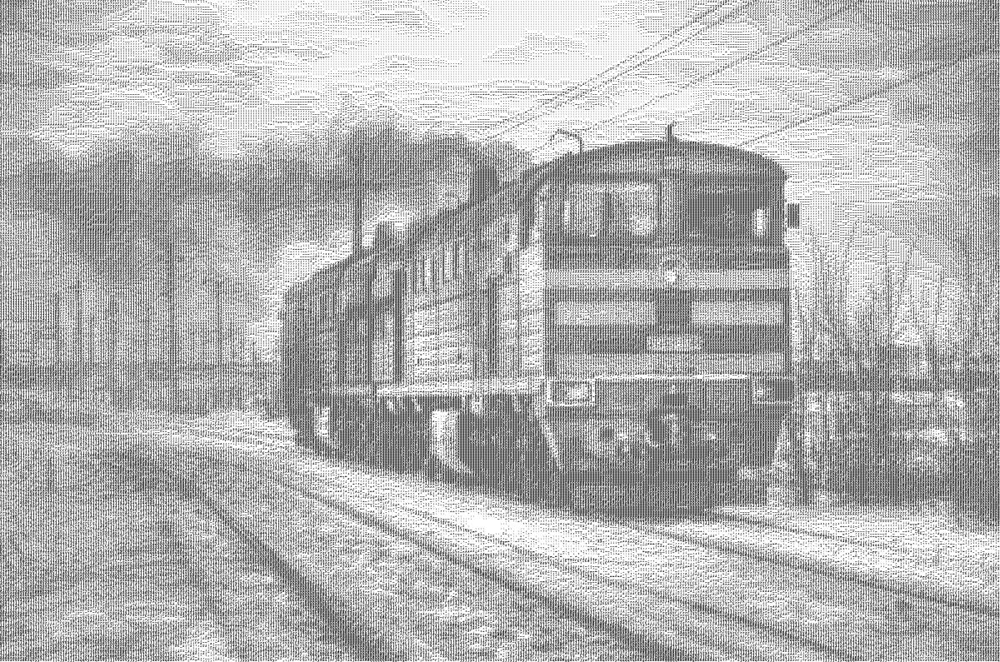

# Ascii artist
## Short description
This program converts an image to so-called "ascii art".  
Key idea is that pixels being replaced by ascii character, that matches the most.

## Usage
To start, run the `python3 demonstration.py` comand in projects directory.

## Results
   
  
   
  
