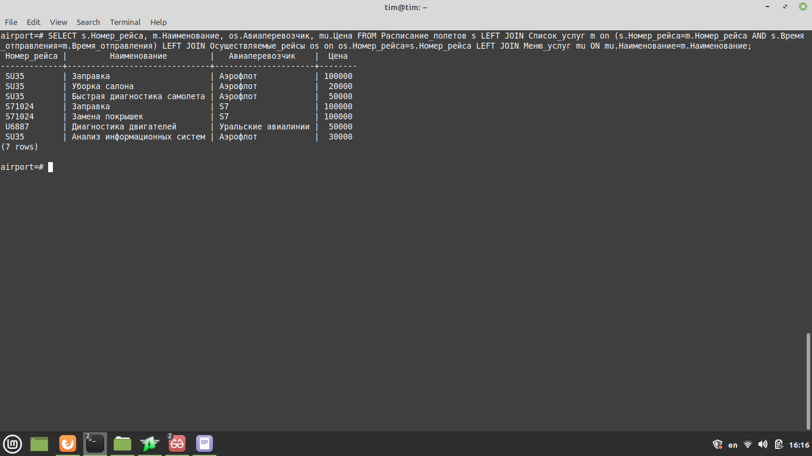

# Database design project

## Description
This is a final project for databases course.  
Task and detailed description are in file `Database design.pdf` 
While designing particular database, many interesting details were discovered about airport work and buisness model.  
All of details descibed in same `Database design.pdf` file. :grin: 
File `Airport.sql` contains setup for PostgreSQL and some data filling.
## Usage
Examples of using database:

