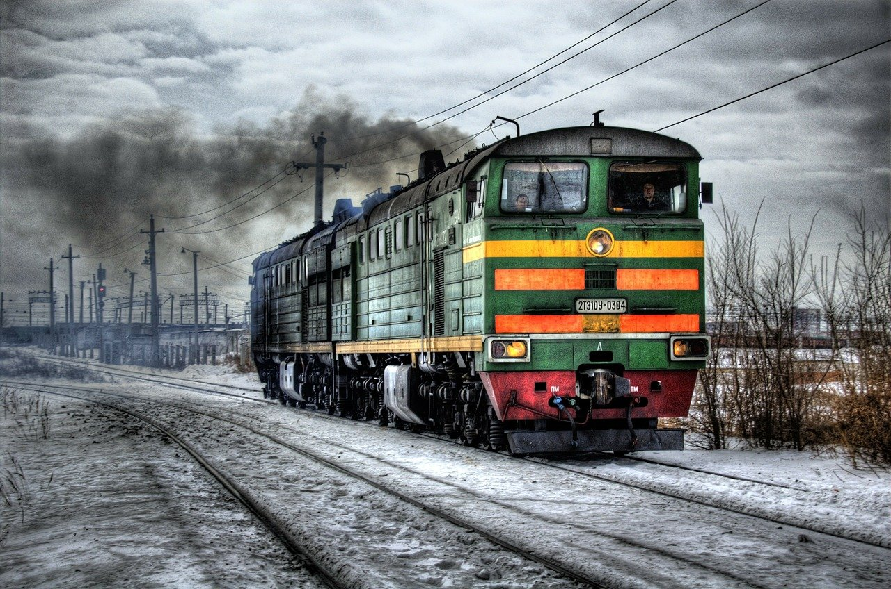

# Ascii artist
## Short description
This program converts an image to so-called "ascii art".  
Key idea is that pixels being replaced by ascii character, that matches the most.

## Usage
Example of using this programme is provided in `demonstration.py` file.

## Results
   
  
   
  
